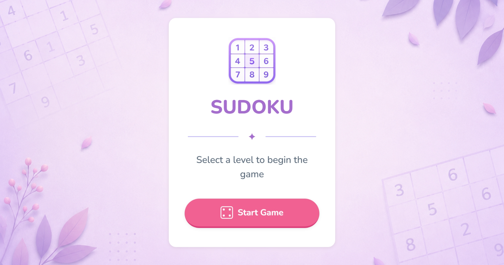
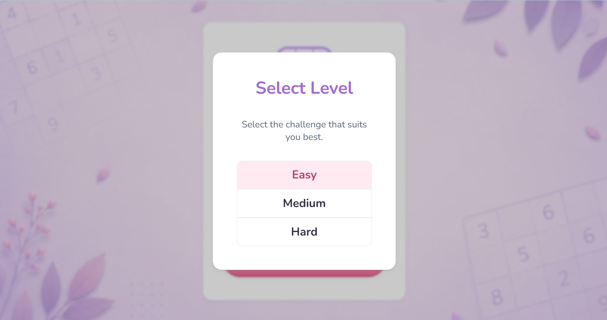
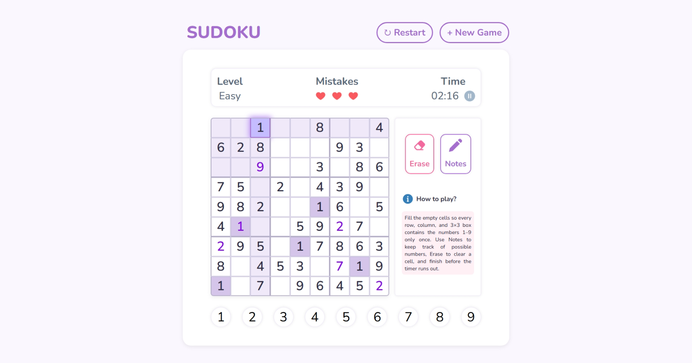
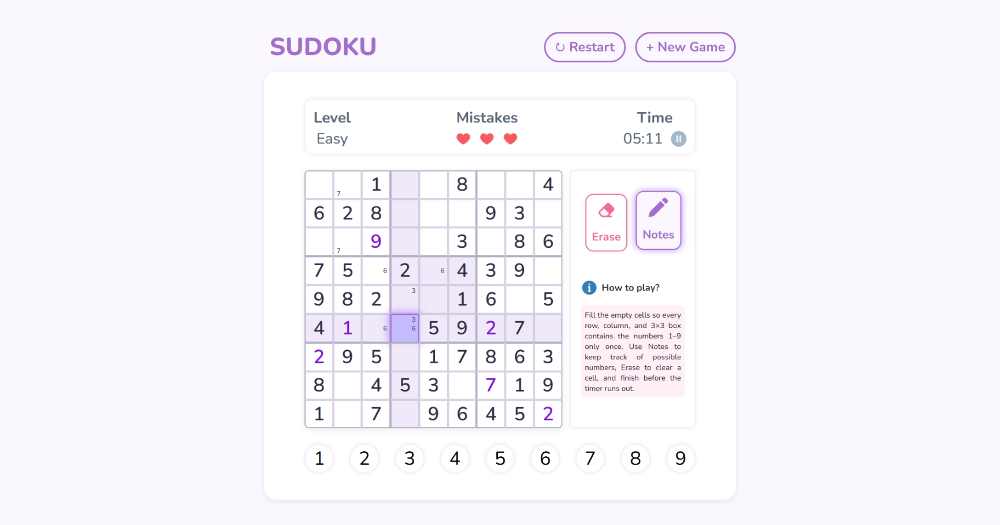
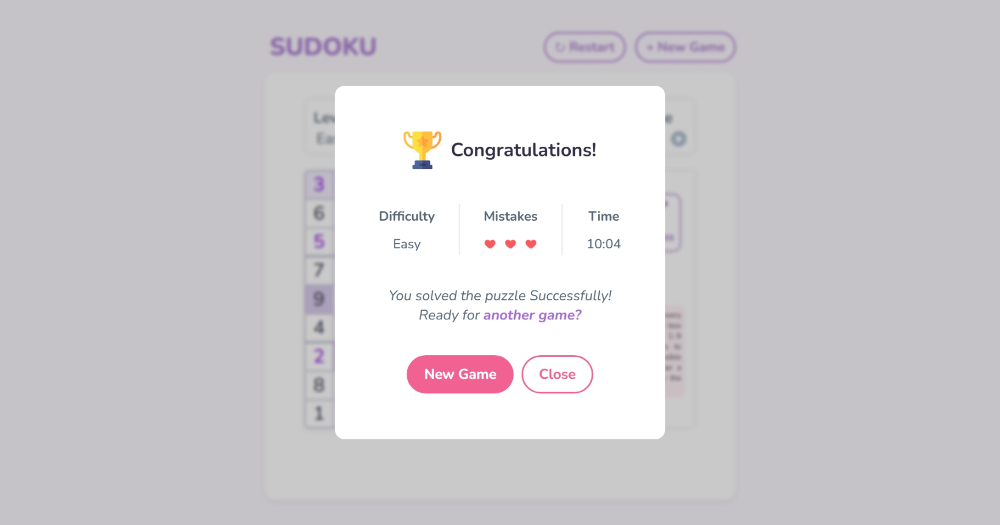
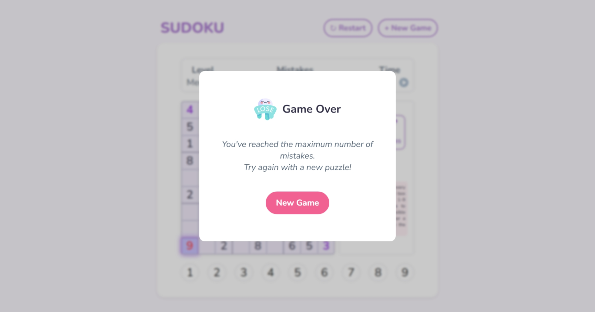

# Sudoku Game

## Description
Sudoku is a web-based implementation of the classic Sudoku puzzle game built with HTML, CSS, and JavaScript. Players solve randomly generated 9×9 puzzles by placing numbers according to the classic Sudoku rules. Each puzzle is generated using a backtracking algorithm and guaranteed to have a unique solution.
##  Live Demo
### 🎮 [Play Sudoku](https://zaraaa82.github.io/sudoku-game/)
## Screenshots
### Start Screen

### Difficulty Selection

### Gameplay

### Notes Mode

### Win Screen

### Game Over

## Technologies Used
- HTML5
- CSS3
- JavaScript (ES6)
- DOM Manipulation
- Git
- GitHub

## Features

- Unique solution guarantee
- Randomly generated Sudoku puzzles
- Three difficulty levels (Easy, Medium, Hard)
- Notes (pencil marks) mode
- Automatic note updates
- Mistake tracking with three lives
- Countdown timer with pause and resume
- Restart current puzzle
- Start a new game
- Interactive cell, row, column, and 3×3 box highlighting
- Same-number and conflicting-number highlighting
- Number completion tracking
- Keyboard and mouse controls
- Win, game over, and timeout detection
- Smooth animations and visual feedback

## Future Enhancements
- Hint system
- Undo functionality
- Save and resume games
- Player statistics and best times
- Dark mode
- Customizable game settings

## User Stories
- **US-01: Sudoku Board Setup**  
    As a player, I want the game to display a Sudoku board with some cells already filled so that I can begin solving the puzzle.

- **US-02: Fixed Cell Protection**  
    As a player, I want the starting numbers to be locked and visually distinct from my inputs so that I do not accidentally modify them.

- **US-03: Number Entry**  
    As a player, I want to select a cell and enter a number from 1 to 9 so that I can solve the puzzle.

- **US-04: Input Validation**  
    As a player, I want the game to validate my entries and provide feedback for incorrect values so that I can identify mistakes.

- **US-05: Error Tracking**  
    As a player, I want an error counter that tracks my mistakes and ends the game after three incorrect entries so that the game remains challenging.

- **US-06: Puzzle Completion Detection**  
    As a player, I want the game to detect when the puzzle is solved correctly and display a completion message.

- **US-07: Cell Clearing**  
    As a player, I want a clear button to remove my input from a selected cell so that I can correct a mistake.
    
- **US-08: Game Restart**  
    As a player, I want to restart the puzzle and reset the timer so that I can attempt the same puzzle again from the beginning.

    
## Credits
Developed by **Zahraa Alaiwi** as part of *the General Assembly Software Engineering Bootcamp*.